# 跟我学Python

### 一、引言

我作为一个非计算机专业的学生，Python这一门语言是我的入门语言，但是在学习Python的过程中遇到过许多问题，也花了许多时间解决。制作这一个仓库是想用全中文，最适合新手的方式来教学Python。在这里会教学日常使用中最为常用的Python语句。跟我一起学习这一门当今热门的语言。

**一起学习，一起进步！**

- 所有代码中都用中文进行注解。
- 如果是0基础学习可以跟着本文档进行学习。
- 同时也可以直接看代码文件进行学习。

> [!TIP]
>
> 在本仓库中遇到的问题欢迎提出Issues。

> [!NOTE]
>
> 我的电脑是MacBook，因此所有的代码编写和操作都基于MacOS，不过在Windows系统中在代码编写方面并为有太大区别所以对学习没有太大影响。如果有特殊的情况我会作出说明，希望大家理解～～。

---

### 二、Python的安装

学习一门语言的第一步就是安装这一门语言。我会分别从MacOS和Windows系统进行介绍。首先先放出Python的下载官网。

- [Python官方网站](https://www.python.org/downloads/)

如果上面这个链接没法进入的话可以点击下面的链接

- [Python中文网站](http://python.p2hp.com/downloads/)

#### 2.1 MacOS

1. MacOS在进入网站后点击<u>下载</u>中的macOS。

   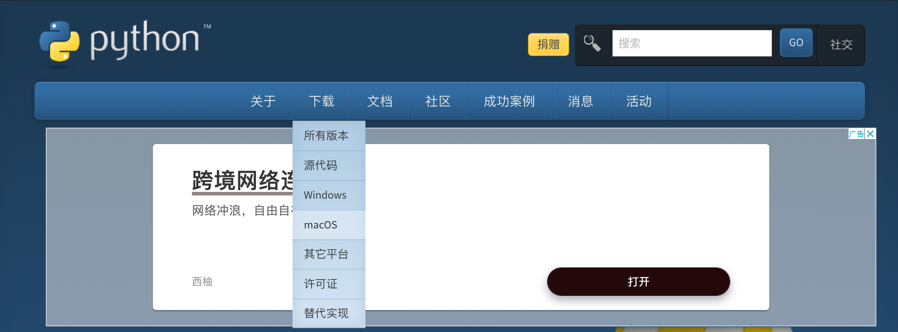

2. 选择一个需要的版本，根据自己电脑的芯片版本选择（M系列和英特尔系列）。

   > 本仓库中的教程均使用Python3.9.6这一个版本。

   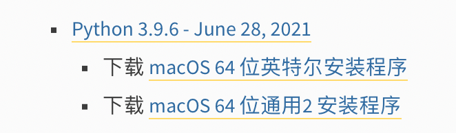

3. 点击下载链接，会下载到一个.pkg文件。

   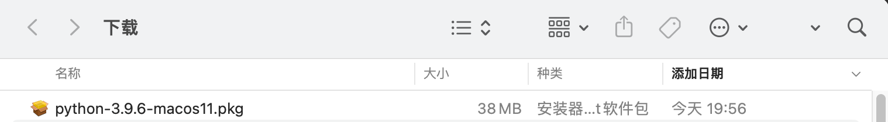

4. 双击打开这一个文件跟着安装器一步一步继续便安装完毕。

   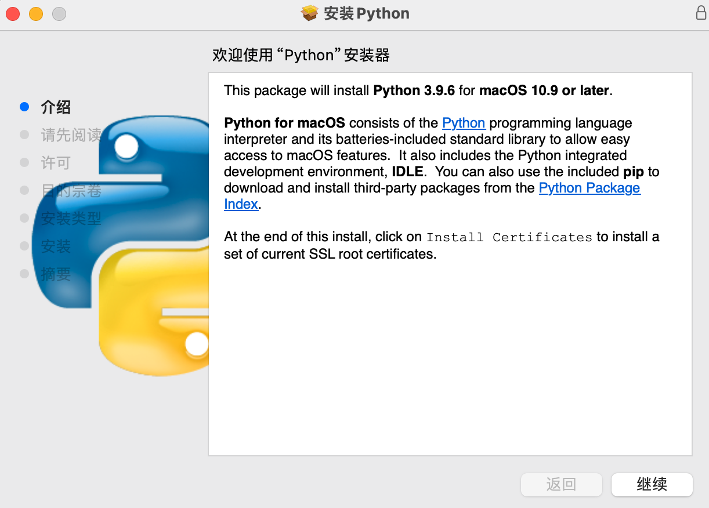

5. 安装后在电脑的命令行（名叫**终端**这一个软件）输入以下命令回车，若命令行出现Python 3.9.6，则说明安装成功。

   ```shell
   python3 -V
   ```

#### 2.2 Windows系统

后续再更新哦～～

---

### 三、开发环境Vscode的安装

我们已经安装好Python了，但是如何用Python写出我们的程序是一个问题，Python在安装完成后可以在命令行中直接运行。只需要在命令行中输入：

```shell
python3
```

如此便可以编写Python代码了。不过这种方式并不是主流的编写方式，而且使用该方式编写不能很好的管理我们的代码。（不必理会）

为了更加清晰方便的编写我们的Python代码我们需要下载一个优秀的开发环境，在开发环境中我们可以运行Python代码，可以加快我们的编写速度，可以更加方便的管理我们的代码。（可以理会）

因此我隆重介绍我们的明星开发环境**<u>Vscode</u>**

> 虽然我当初学习的时候并没有用过，但是Vscode是十分适合小白开始编写代码的环境，直接少走10年弯路。

我们开始安装。

#### 3.1 MacOS

1. 首先先上链接[Vscode官方网站](https://code.visualstudio.com)

2. 点击Download，进入下载界面，选择你电脑对应的版本。

   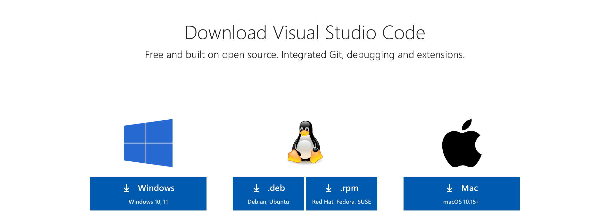

3. 下载后我们得到了一个.app文件，这一看就是一个应用，都不需要安装诶。我们把下载来的Vscode拖动到自己想放的地方，一般是苹果电脑访达中应用程序（推荐动一动doge）。

   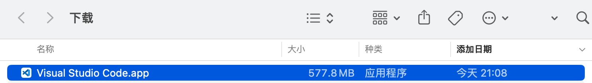

4. 双击打开，打开后我们就是这样一个界面。一打开就是英文就很烦～～，所以我们需要下载一个扩展插件来显示中文，这非常简单。先点图中框起来的选项。

   > 这个安装扩展插件的地方很重要里面有非常丰富的插件可以使用。

   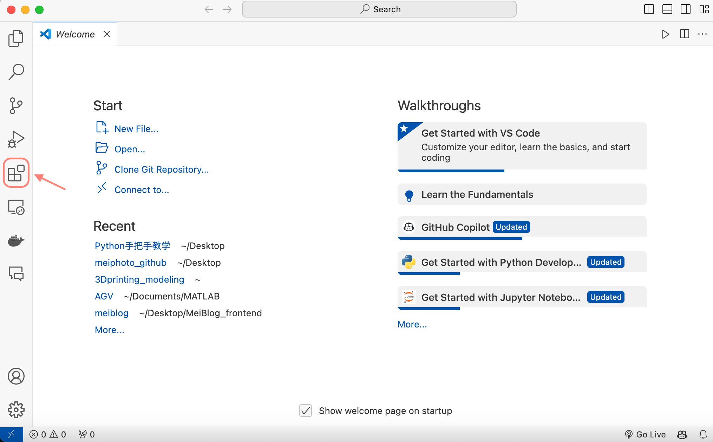

5. 在搜索框搜索chinese，点击第一个插件安装Install，之后会提醒你重启，重启之后就可以显示中文了。

   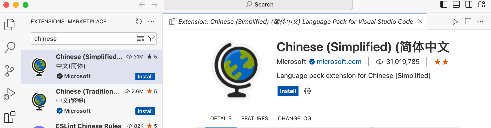

6. 说回Python我们同样在安装扩展插件的地方搜索Python，点击第一个插件安装，便可以在Vscode里编写运行Python代码了。

   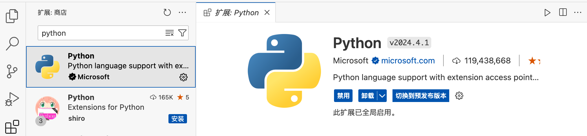

#### 3.2 Windows系统

后续再更新哦～～

---

### 四、 Python基础部分

接下来我们正式走进Python，代码我都会放在仓库的<u>LearningCode</u>文件夹里。

#### 4.1 第一句Python代码

我们把Python安装完成好了，也下载好了我们的Vscode开发环境。那么我们可以开始我们的码农生涯了。

1. 我们在电脑的任意位置创建一个文件夹叫<u>LearningCode</u>。（可以先在桌面创建一个）

2. 打开Vscode，点击打开，选择你创建的文件夹，我就选择LearningCode。

   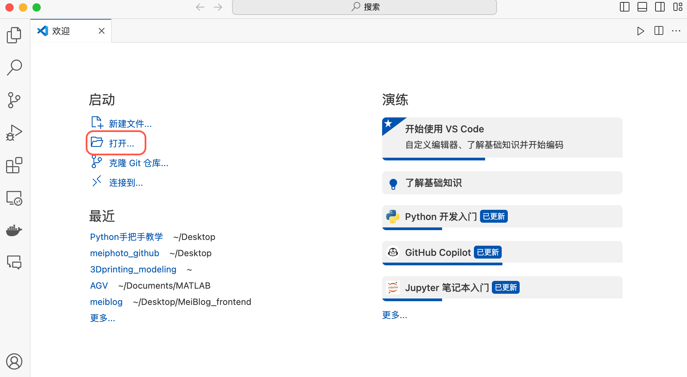

3. 打开后，我们点击左上角图中框住的图标，这是创建一个新的文件夹，我们取名为<u>python基础部分</u>。

   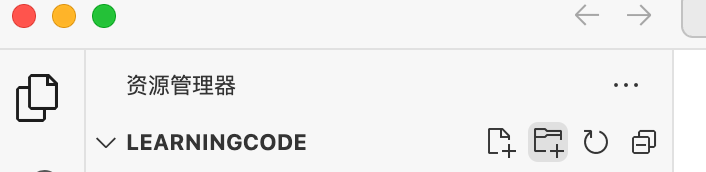

4. 再右键这个<u>python基础部分</u>文件夹点击新建文件新建一个名叫<u>firstcode.py</u>的文件。这个文件就是Python文件，Python文件都以.py这个后缀结尾，我们可以在这个文件中编写Python代码。

   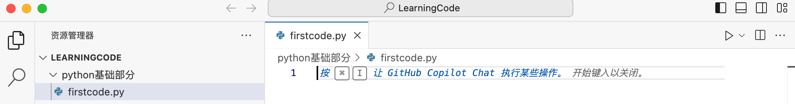

5. 在文件中编写第一句Python代码，之后点击图中所示右上角的三角形便可以运行这段代码，运行代码之后在Vscode的下方会弹出终端（就是之前打开的命令行），在终端里会显示代码的输出结果。

   ```python
   print("学习Python，就认准BAIGUANGMEI！")
   ```

   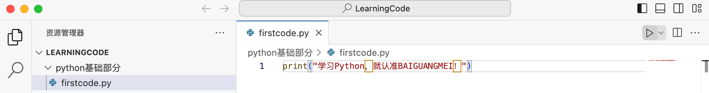

   运行结果如下图，红线划出的内容是刚刚那个语句输出的结果。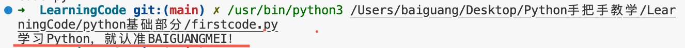

这样我们完成了第一句Python代码的编写，这一句代码的意思就是在终端中打印*学习Python，就认准BAIGUANGMEI！*这一句话。所以我们学习到了Python的第一个语句是`print()`，就是打印括号里的内容。

#### 4.2 Python的数据类型和变量

在4.1中我们写出了第一句Python代码，那我们就想知道`print()`可以打印哪些内容呢，我们就可以从数据类型来说起，数据类型简单来说就像我们在word软件里打字会打出文字，数字等等，这些就是不同的数据类型。但要了解数据类型前我们需要了解变量。

> [!IMPORTANT]
>
> 接下来的内容直接在LearningCode文件夹中更新，我会在下面放出具体教学内容的链接。README文档中会作出每个部分的总结。

#### 4.3 Python的注释

#### 4.4 Python的输出

#### 4.5 Python的输入

#### 4.6 Python的运算符

#### 4.7 Python的条件语句

#### 4.8 Python的循环语句


